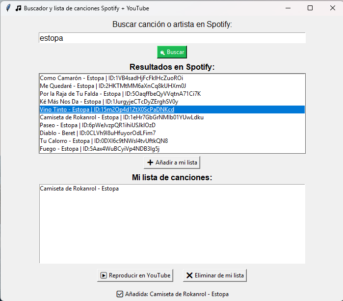

# 🎵 Spotify + YouTube Song Manager

Una aplicación de escritorio hecha en Python que te permite:

- Buscar canciones directamente en Spotify sin necesidad de tener playlists
- Crear tu propia lista personal con canciones seleccionadas
- Reproducir fácilmente las canciones en YouTube
- Usar una interfaz gráfica simple y amigable con Tkinter

---

## 📸 Capturas

 <!-- Puedes añadir una imagen/gif si deseas -->

---

## 🚀 Requisitos

- Python 3.8+
- Una cuenta de desarrollador de Spotify (para obtener Client ID y Secret)
- Conexión a Internet

---

## 🧠 Tecnologías usadas

- [Spotipy](https://spotipy.readthedocs.io/) – cliente para la API de Spotify
- [youtube-search-python](https://pypi.org/project/youtube-search-python/) o [youtube-search](https://pypi.org/project/youtube-search/)
- [yt_dlp](https://github.com/yt-dlp/yt-dlp) *(opcional)*
- [Tkinter](https://wiki.python.org/moin/TkInter) – interfaz gráfica

---

